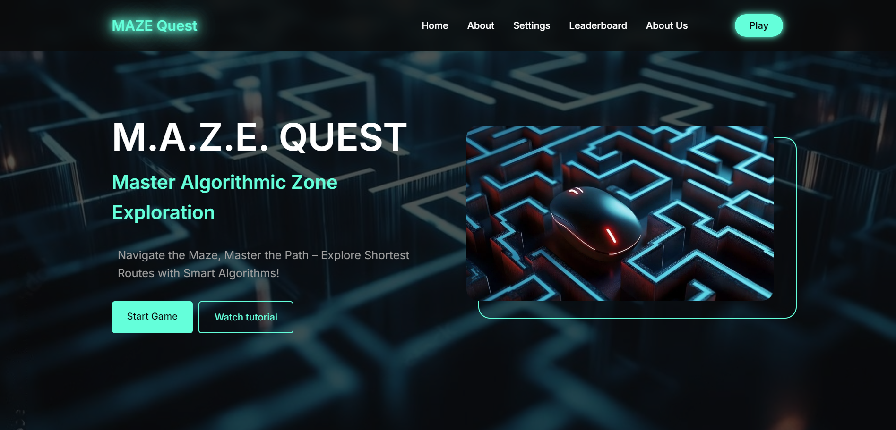
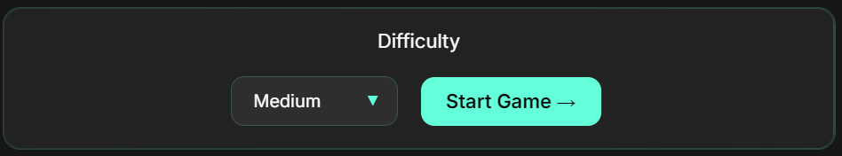
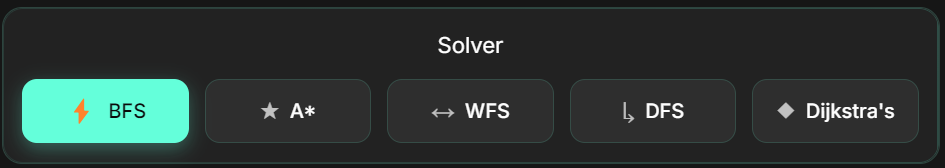
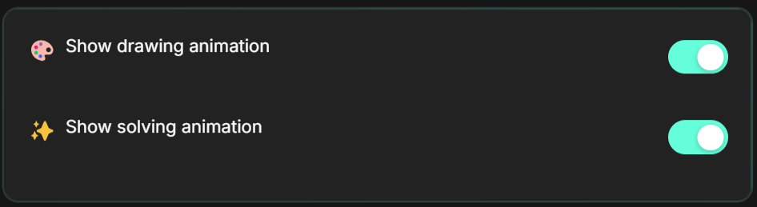
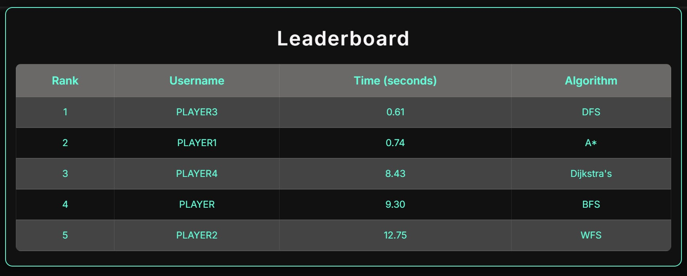
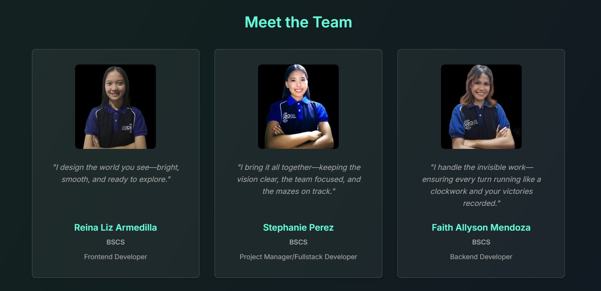

<h1 align="center"><b>🌐 M.A.Z.E. Quest 🌐</b></h1>
<h2 align="center"><b>Master Algorithmic Zone Exploration</b></h2>
<h2 align="center"><b>Navigate the Maze, Master the Path – Explore Shortest Routes with Smart Algorithms!</b></h2>

---

## 📜 **Overview**  
Welcome to **M.A.Z.E. QUEST**, where pathfinding meets fun! Ever wondered how algorithms like **A\*** and **Dijkstra** solve real-world problems? This game-turned-visualizer allows you to interactively explore the magic of pathfinding. Choose a starting and ending point, add obstacles, and watch algorithms dynamically calculate the optimal path.  

M.A.Z.E. QUEST isn’t just a game – it’s an **educational journey wrapped in fun**! Perfect for students, coding enthusiasts, and curious minds, it offers a chance to visualize and experiment with real-world algorithms while solving exciting mazes.  

---

## 🎮 **Key Features**  

- **🧭 Algorithm Explorer**: Choose from **A\***, **WFS**, **BFS**, **DFS**, or **Dijkstra** to solve the maze.  
- **🎨 Game Themes**: Customize the maze’s appearance with themes like **Neon Nights**, **Cyber Punk**, **Ocean Deep**, and **Arctic Frost**.  
- **✨ Real-Time Visualizations**: See step-by-step recalculations as algorithms adapt to obstacles and waypoints.  
- **📈 Educational Pop-Ups**: After solving, view a detailed explanation of steps taken, path length, and time complexity.  
- **🏆 Leaderboards**: Track your fastest times and compare performance across algorithms.  

---

## 🚀 **Getting Started**  

### Prerequisites  
Ensure you have the following installed:  
- 🖥️ **Python 3.8+** for backend development.  
- 🔥 **Flask** for creating backend APIs.  
- 🛠️ **Firebase** for managing leaderboard and user data.  
- 🌐 **Node.js** for frontend development.  
- 🌐 **A modern web browser** for frontend compatibility.  

🕹️ **How to Play**  
- **Select Difficulty and Algorithm**:  
  Choose your difficulty and algorithm (A*, Dijkstra, BFS, etc.) from the start menu.
  
  

- **Customize the Maze**:  
  - Create or skip maze creation for quicker gameplay.  
  - Add barriers and set start/end points.

- **Additional**:
    
    - 🎨 Show drawing animation as the maze is being generated.
    - ✨ Show solving animation as your selected algorithm calculates the path.
  

- **Solve the Maze**:  
  Watch solving animations as your selected algorithm calculates the path.  
  After completion, view an educational pop-up explaining:
  - Algorithm
  - Steps taken.  
  - Path length.  
  - Time complexity.
- **Restart or Quit**:  
  Use the pop-up menu after solving to restart the maze or exit the game.

- **Leaderboard**:  
    
  - Fastest times rank highest.  
  - Track and compare your performance with stored trial records.

---

⚙️ **Algorithms Available**  

📌 **Dijkstra’s Algorithm**:  
A thorough, non-heuristic approach that evaluates all possible paths for accuracy.

🧩 **A\* Algorithm**:  
Combines Dijkstra's method with a heuristic to prioritize paths closer to the goal.

🔄 **BFS (Breadth-First Search)**:  
Explores all neighboring nodes layer by layer, ensuring the shortest path in unweighted mazes.

🔍 **DFS (Depth-First Search)**:  
Searches deeper into the maze before backtracking, suitable for exploring large areas.

↔ **WFS (Weighted First Search)**:  
Balances exploration with weighted prioritization for obstacles and detours.

---

🎨 **Game Themes**  

Select a visual theme to change the appearance of your maze:  
- 🌌 **Neon Nights**  
- 🖤 **Cyber Punk**  
- 🌊 **Ocean Deep**  
- ❄️ **Arctic Frost**  

---

👥 **Development Team**  

---

📄 **License**  
This project is licensed under the MIT License. See the LICENSE file for details.

---

📬 **Contact**  
For questions, suggestions, or issues, reach out via the repository’s issue tracker or directly contact the development team.
